# Overview
In this project, the following two tasks are done:
## Model as a service
A machine learning model is trained and deployed to be used as a web service. To get that model, an auto ML pipeline is created and run using Azure Python SDK.  
Once the run is complete, the best model can be deployed using Azure ML studio. As a result, URI to the model is provided, along with a swagger json,  so the model can ba called using HTTP.
## Pipeline as a service
Machine learning pipeline is created and published in the same way as the model above to get a REST API, so the pipeline can be consumed using HTTP as well.
# Architecture
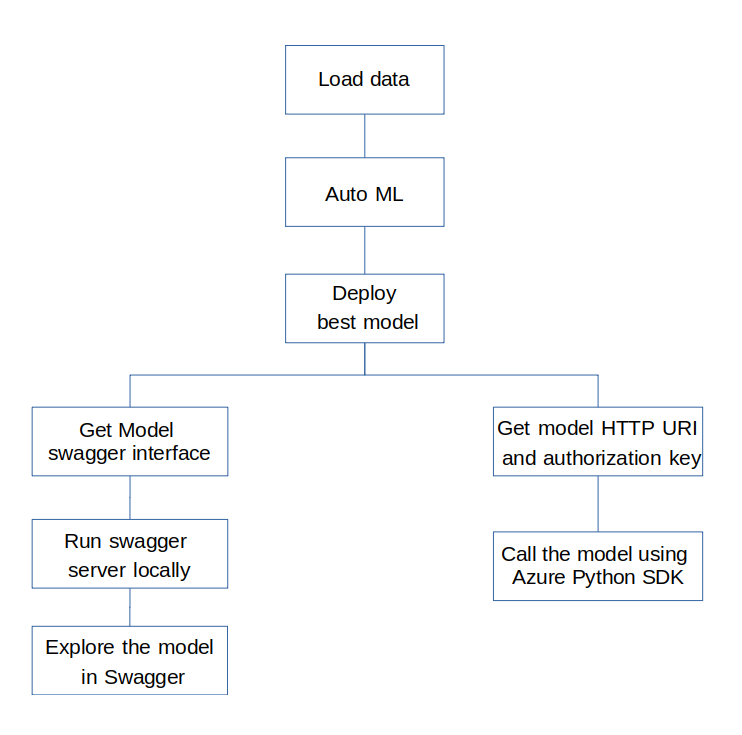
# Improve the project
1. Consume the pipeline as a service using Python SDK and Swagger as well
2. Detect model performance drop for some reason, define the reason and fix it, retrain the model using the pipeline web service, deploy the model.
3. Split the notebook into two parts, one for the model and one for the pipeline
4. Let the student do some coding would be nice
# Screenshots
Here we will go through the steps of the project along with the screenshots of functioning steps.  
1. Dataset of the bankmarketing is registrered in Azure ML:  
We have to have data to start with, the following screenshots shows the dataset we are going to use registered in the Azure ML studio.
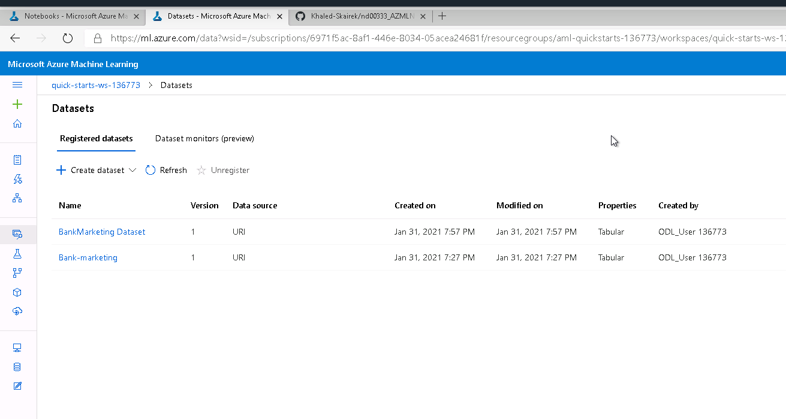
2. Experiment is complete  
The following screenshot shows the experiment in the state complete, which means the pipeline (load data + auto ml) was complete.
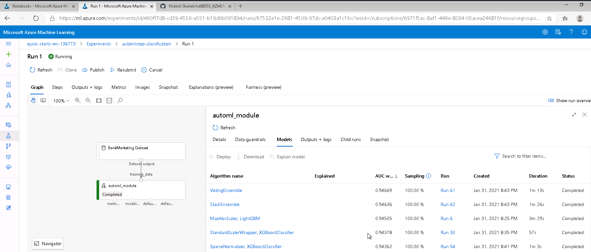
3. Best model  
Once the auto ml module step is complete, the list of models are available the the best model in terms of performance measure is chosen. Here are some details of the best model:
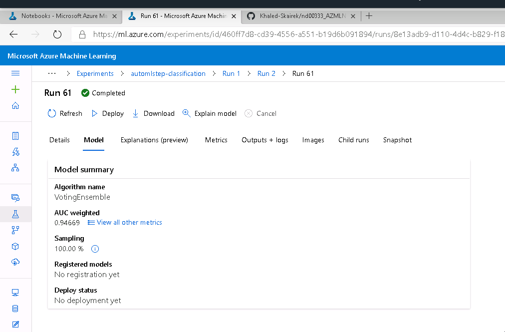
4. Application insights  
We choose the best model for deployment and enable "Authentication" while deploying the model using Azure Container Instance (ACI). The executed code in logs.py enables Application Insights. "Application Insights enabled" is disabled before executing logs.py.
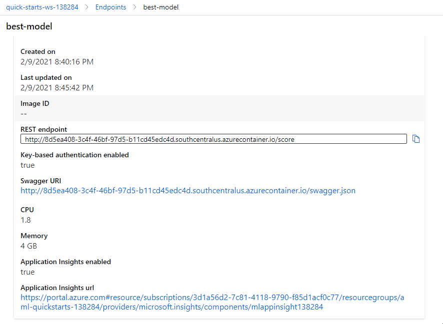
5. Logs  
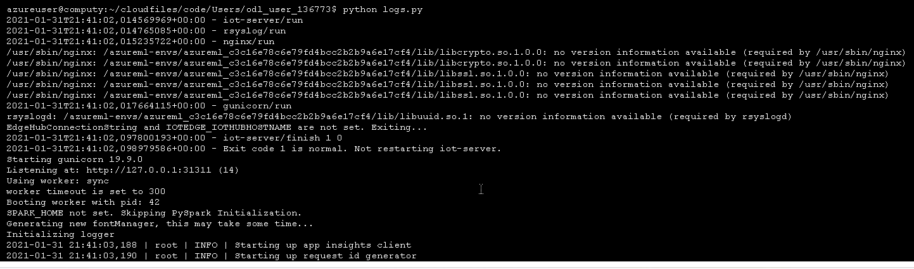
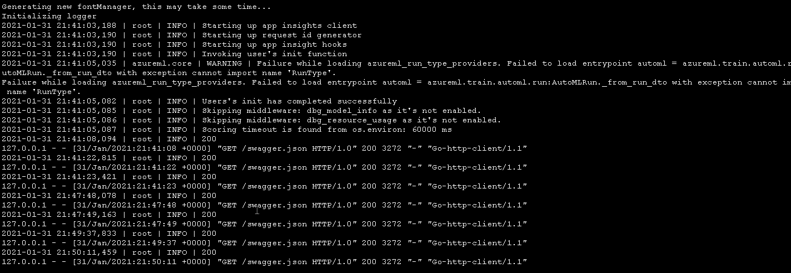
6. Swagger runs on localhost  
We use Swagger to communicate ith the deployed model API, for that we have a local Swagger server setup as we can see in the following screenshots:
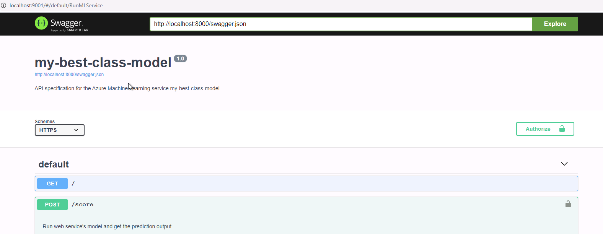
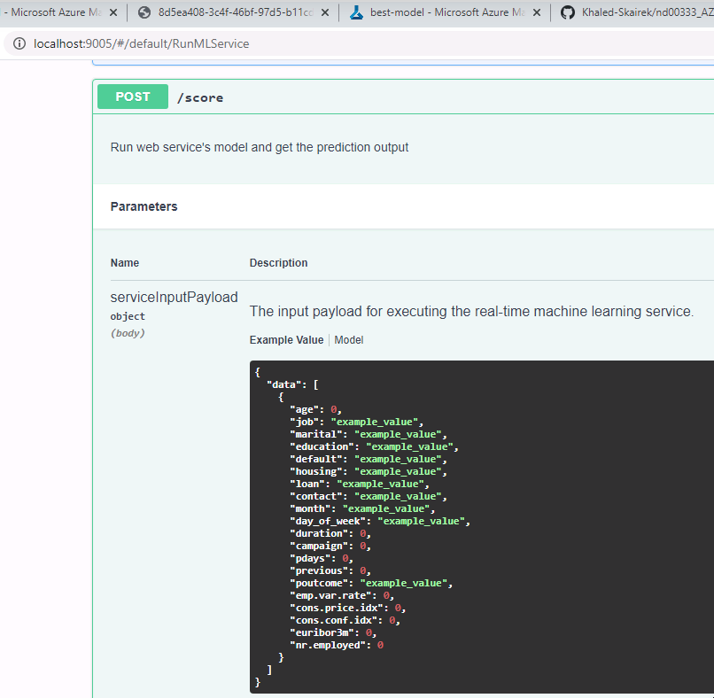
7. Endpoint  
Once the model was successfully deployed, it can be used. The following image shows the response of the deployed model after sending JSON Payload data in the form that the model expects. To have a look at the format of data needed, one can use Swagger.
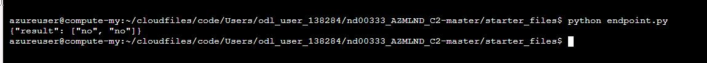
8. Apache benchmark shows statistics about the model performance which can be used as a baseline for potential further improvement
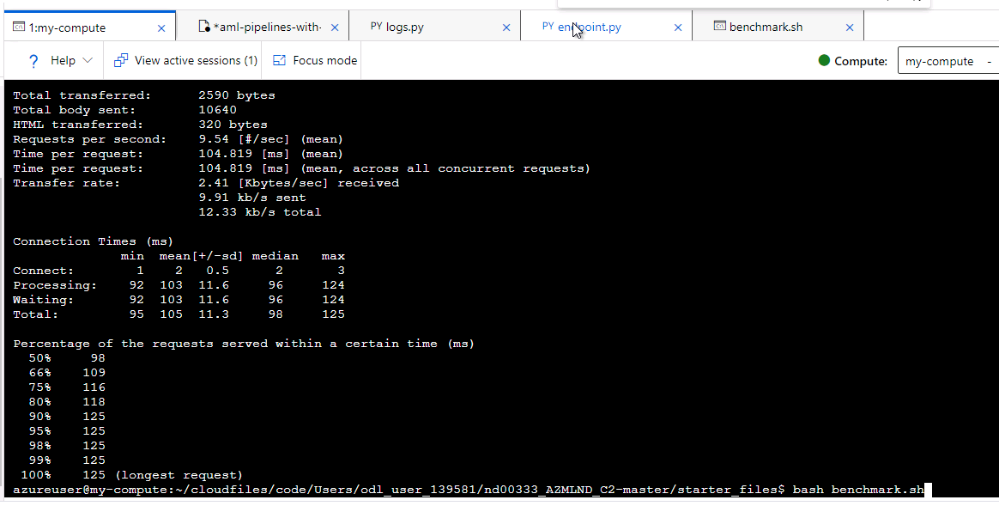
9. Pipeline  
At the end, here are somescreenshots showing the published pipeline as a service and the information needed call it.
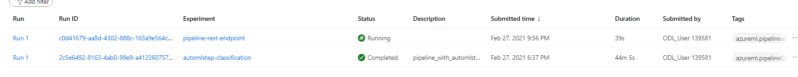
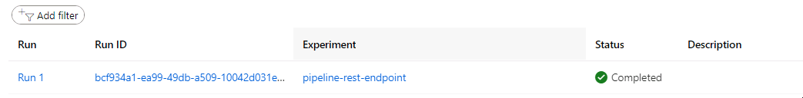
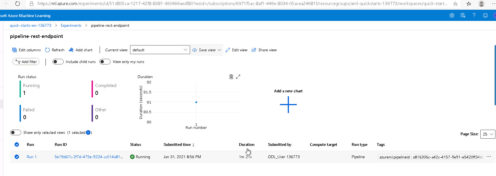
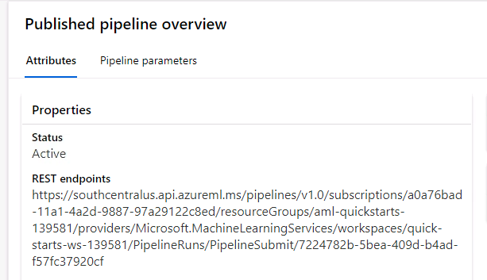
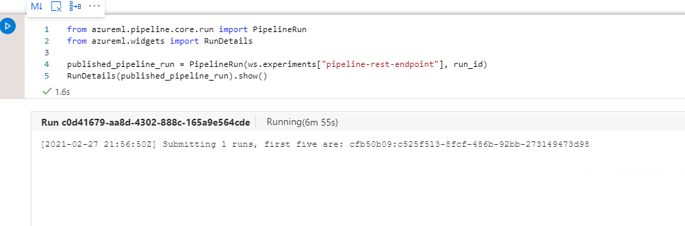
# Screencast
https://www.youtube.com/watch?v=77lq0y5L8Eg
